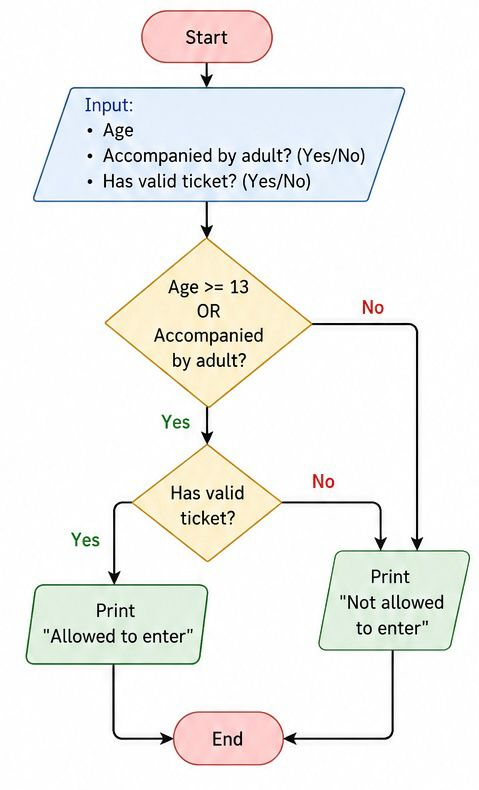

# Tutorial 2 - Movie Theater Admission Policy

## Identify the Components

### 1.1 Inputs
- Age (Is the age >= 13?)
- Accompanied by an adult? (Yes/No)
- Has a valid ticket? (Yes/No)

### 1.2 The Process
- Check the conditions: The person must have a valid ticket AND be either 13+ years old OR accompanied by an adult. 
  - If conditions are met: Allow entry
  - Else: Deny entry

### 1.3 Outputs
- "Allowed entry" OR "Not allowed entry"

---

## Design the Algorithm

### 2.1 The Algorithm Diagram

### 2.2 The Truth Table 

| Age ≥ 13 | Accompanied by Adult | Valid Ticket | Result |
| :---: | :---: | :---: | :--- |
| Yes | Yes | Yes | Allow Entry |
| Yes | Yes | No | Deny Entry |
| Yes | No | Yes | Allow Entry |
| Yes | No | No | Deny Entry |
| No | Yes | Yes | Allow Entry |
| No | Yes | No | Deny Entry |
| No | No | Yes | Deny Entry |
| No | No | No | Deny Entry |

### 2.3 Step-by-Step Algorithm
1. Start
2. Input `age`.
3. Input `accompanied_by_adult` (Yes/No).
4. Input `has_valid_ticket` (Yes/No).
5. If `has_valid_ticket` is "Yes" AND (`age` >= 13 OR `accompanied_by_adult` is "Yes"):
   - Print "Allowed entry"
6. Else:
   - Print "Not allowed entry"
7. End
